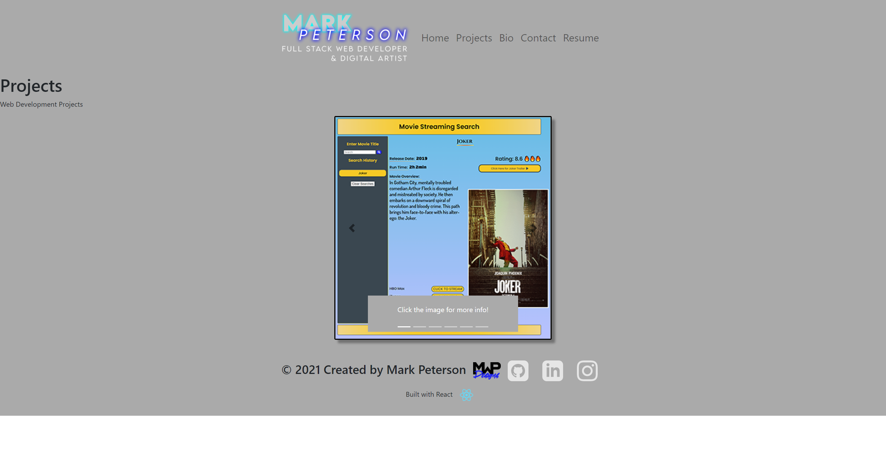

# **Budget Tracker PWA**   
## **In this weekly challenge, we were tasked with creating professional portfolio as a single page application utilizing React.js  **

## **Table of Contents**

* [Deployed Application](#deployed-application)

* [Screenshot](#screenshot)

* [Features](#features)

* [Usage](#usage)

* [License](#license)

* [Badges](#badges)

* [Technology](#technology)

* [Contact](#contact-information)

## **Deployed Application**
Github 
https://github.com/mwpx777/mark-peterson-react-portfolio

Deployed Application

## **Screenshot**

## **Features**
This project features React.js, CSS, Javascript and Node.js 

## **Usage**
This React.js portfolio application will be used to show potential employers my skills and links to projects I created for the full stack web development course.

## **License**
(https://opensource.org/licenses/MIT)

## **Badges**

## **Technology**
React.js, Javascript, Node.js 

## **Contact Information**
##### For questions or comments, please contact

* Github: (https://github.com/mwpx777)

* LinkedIn: (https://www.linkedin.com/in/mwpdesigns/)

* Email: (mwpx777@gmail.com)

